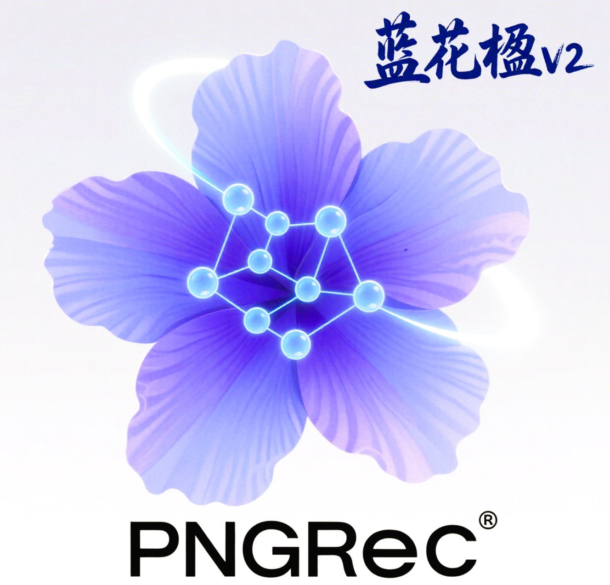

 

  

# PNG
## Popular-Niche Wavelet Graph Learning for Multimodal Recommendation

## 对比实验
### Baby

nohup python main.py -m PNG -d baby > output_PNG_baby_20250717.log 2>&1 &
### sports
nohup python main.py -m PNG -d sports > output_WaveRec_sports_20250522_exp1.log 2>&1 &
### clothing
nohup python main.py -m PNG -d clothing > output_WaveRec_clothing_20250522_exp1_cl_loss.log 2>&1 &
